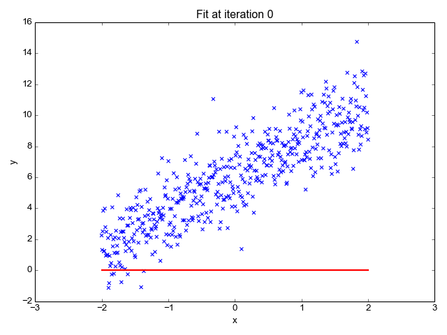
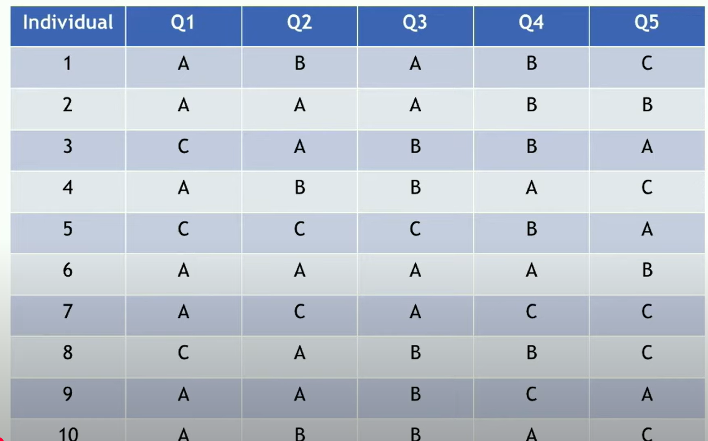
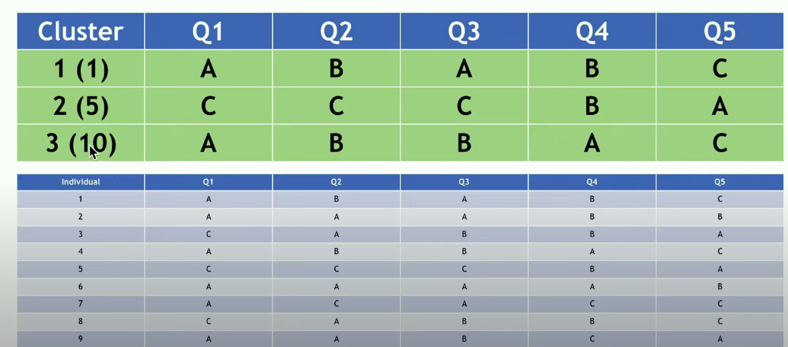
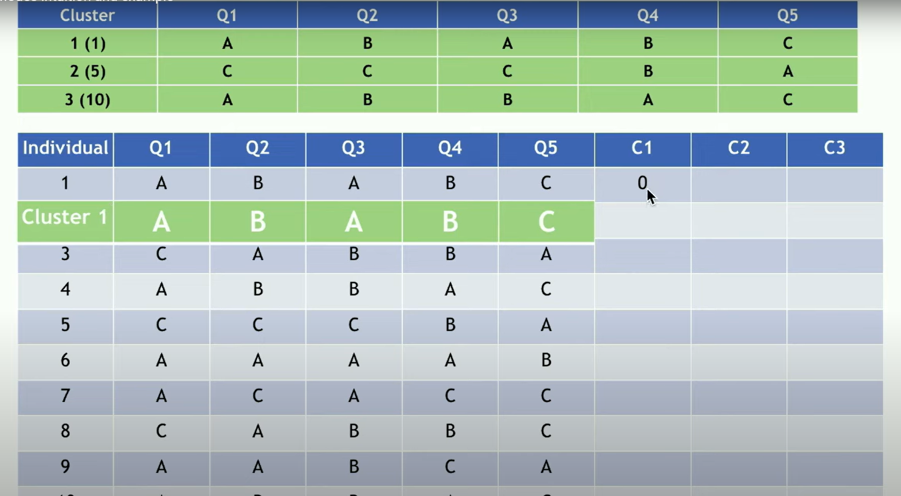
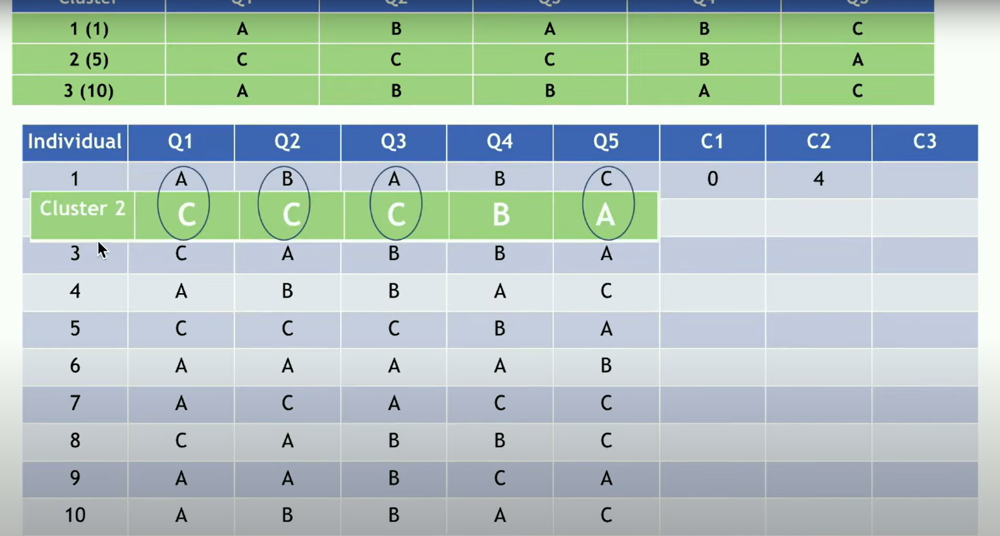
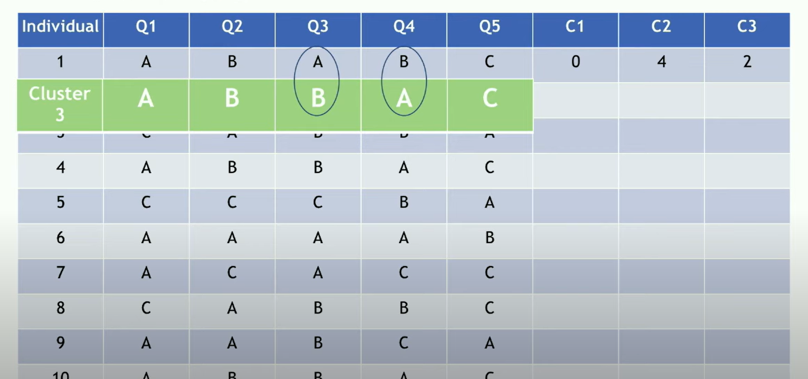
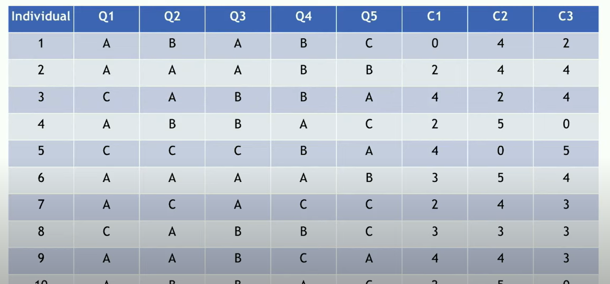
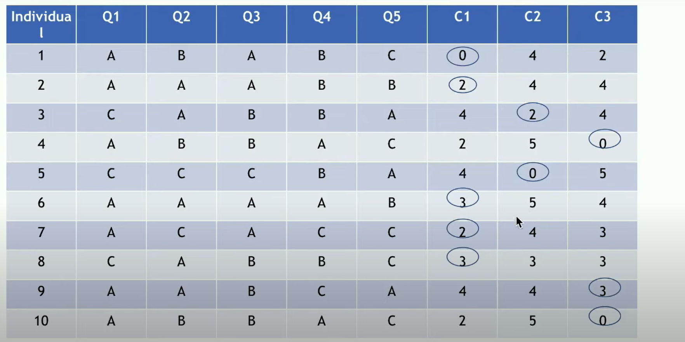
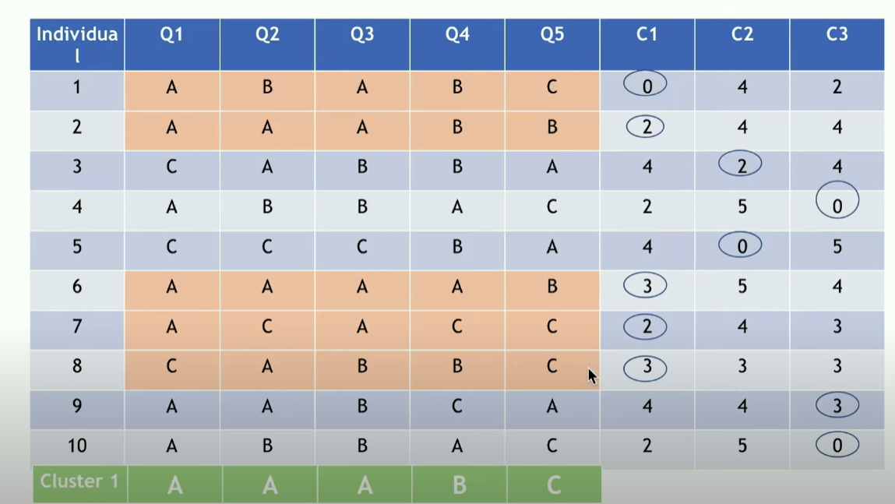
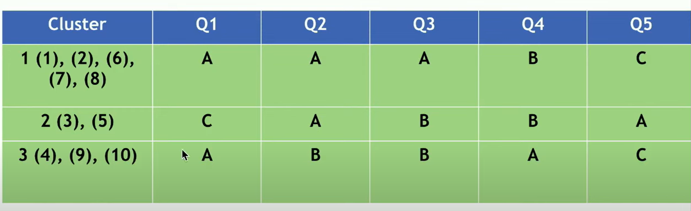

## Tipos de algoritmos de ML

Los algoritmos de machine learning se suelen clasificar en dos grupos, por un lado se encuentran los algoritmos **supervisados** que aplican lo que se ha aprendido con los datos históricos para sacar conclusiones sobre nuevos datos y por otro lado se encuentran los algoritmos **no supervisados** que pueden extraer inferencias de conjuntos de datos.

Los algoritmos **Supervisados:** Se clasifican en problemas de regresión y clasificación, tenemos que pensar que lo que se fundamenta en crear modelos con información histórica para luego poder predecir en el futuro; por ej. aprender a clasificar correos como spam, donde ya sabemos qué correos son spam y cuáles no.

Por su parte los **No** **Supervisados:** son aquellos donde no se tiene variable respuesta. El objetivo es encontrar patrones / asociaciones ocultas a prirmera vista o sobre las cuales por ahí tenemos alguna hipótesis que ya veniamos trabajando en el análisis exploratorio. Por ejemplo, agrupar clientes con comportamientos de compra similares sin saber de antemano cuántos grupos existen.

También existe un tercer tipo de algoritmo que llamamos **Aprendizaje por refuerzo:** y que funciona con un mecanismo de recompensa. Un agente (la máquina) interactúa con el entorno y prueba una variedad de métodos para alcanzar un resultado. El agente es recompensado o castigado en función de las acciones que realiza. Un ejemplo clásico es el entrenamiento de robots o sistemas de juegos para que aprendan a maximizar una recompensa.

## Aprendizaje supervisado: Problemas de clasificación y regresión

"Dentro del aprendizaje supervisado, como mencionamos, tenemos dos tipos principales de problemas:

-   **Problemas de clasificación:** Necesitan predecir la clase más probable de un elemento, en función de un conjunto de variables de entrada. Para este tipo de algoritmos, la variable *target* o respuesta es una variable de tipo categórica. Por ejemplo, clasificar un correo como 'spam' o 'no spam', o determinar si la solicitud de un crédito será 'aprobada' o 'rechazada'.

-   **Problemas de regresión:** En vez de predecir categorías, predicen valores numéricos. Es decir, la variable *target* en un problema de regresión es de tipo cuantitativa. Por ejemplo, predecir el precio de una casa en función de sus características, o estimar las ventas futuras de un producto."

### Regresión lineal

Un ejemplo que ya habíamos visto son las regresiones lineales



-   Busca una ecuación lineal que describe mejor la correlación de la variable independiente con la variable dependiente

-   Minimiza la diferencia entre los valores reales, por ejemplo, los precios de las casas, y los valores que predice la línea. En otras palabras, intenta encontrar una línea que represente la tendencia general en los datos

## Aprendizaje no supervisado: clusters

📐 Algunas ideas clave:

Distancia: ¿Qué tan parecidos son los casos?

Centroide: Punto medio del grupo.

Número de clusters (K): cuántos grupos querés encontrar.

Máxima variabilidad inter-cluster mínima variabiliidad intra-cluster

## ¿Cuándo tiene sentido aplicar clustering?

-   Cuando tenemos variables numéricas o fácilmente comparables

-   Edad, ingresos, precios, ratings.

-   También pueden usarse variables categóricas, pero requieren técnicas específicas (y más avanzadas).

-   Cuando hay sospecha de que hay subgrupos ocultos

-   No están explícitos, pero queremos descubrirlos.

-   Ej: "no sabemos qué tipos de usuarios hay, pero intuimos que no son todos iguales".

-   Cuando hay suficientes observaciones

-   Con 5 o 10 filas no tiene sentido.

-   Recomendación mínima: al menos 30-40 casos.

-   Cuando las variables están en escalas comparables

-   Edad y salarios pueden tener rangos muy distintos → hay que escalar o normalizar.

## ¿Cuándo no aplicar clustering?

-   Si ya tenés etiquetas o categorías claras (usá clasificación).

-   Si los datos no tienen sentido comparativo (textos crudos, fotos, etc.).

-   Si hay muchas variables irrelevantes o ruidosas.

-   Si sólo hay una variable: clustering multi-dimensional necesita más de una dimensión

::: callout-tip
Antes de aplicar clustering, mirá los datos: ¿tiene sentido agrupar? ¿qué variables elegirías? ¿las escalas son comparables?
:::

## Manos a la obra

Arrancamos por setear los paquetes que vamos a usar:

```{r}
#| echo: true
#| warning: false

library(tidyverse)    # manipulación y visualización
library(cluster)      # clustering base
library(factoextra)   # visualizaciones
```

Creamos un dataset simple

```{r}
#| echo: true
#| warning: false

set.seed(123)
data <- tibble(
  edad = c(rnorm(20, 25, 3), rnorm(20, 50, 3)),
  ingresos = c(rnorm(20, 1000, 200), rnorm(20, 5000, 300))
)


```

Y le pegamos una breve mirada a los datos

```{r}
ggplot(data, aes(x = edad, y = ingresos)) +
  geom_point() +
  labs(title = "Personas según edad e ingresos")

```

Aplicamos K-means con 2 clusters

```{r}
modelo <- kmeans(data, centers = 2, nstart = 25) 
data$cluster <- as.factor(modelo$cluster)
```

🎨 Visualizamos los grupos

```{r}
ggplot(data, aes(x = edad, y = ingresos, color = cluster)) +
  geom_point(size = 3) +
  labs(title = "Clusters encontrados")

```

## Complicando la cosa un poco

Este ejemplo es bastante sencillo vamos a levantar un poquito la vara

```{r}
set.seed(123)

clientes <- tibble(
  edad = c(rnorm(50, 25, 5), rnorm(50, 40, 4), rnorm(50, 60, 6)),
  gasto_comida = c(rnorm(50, 200, 30), rnorm(50, 350, 40), rnorm(50, 150, 20)),
  gasto_entretenimiento = c(rnorm(50, 80, 15), rnorm(50, 120, 20), rnorm(50, 60, 10))
)


ggplot(clientes, aes(x = gasto_comida, y = gasto_entretenimiento)) +
  geom_point() +
  labs(title = "Gasto en comida vs entretenimiento")


```

📏 Escalado (muy importante si las variables tienen distintas escalas)

```{r}
clientes_scaled <- clientes %>% 
  scale() %>% 
  as_tibble()

```

¿Cuántos clusters? Método del codo

Buscamos el punto donde la curva "dobla" → ahí está el número óptimo de clusters.

```{r}
fviz_nbclust(clientes_scaled, kmeans, method = "wss") +
  labs(title = "Método del codo para elegir número de clusters")

```

Aplicamos K-means (supongamos 3 clusters)

```{r}
k3 <- kmeans(clientes_scaled, centers = 3, nstart = 25)

clientes_clustered <- clientes %>%
  mutate(cluster = as.factor(k3$cluster))
```

Ahora lo visualizamos

```{r}
ggplot(clientes_clustered, aes(x = gasto_comida, y = gasto_entretenimiento, color = cluster)) +
  geom_point(size = 3) +
  labs(title = "Clusters de clientes según gasto") +
  theme_minimal()

```

## Cluster con variables categóricas: el uso de k-modas

#### **¿Qué hace K-modes?**

Es una extensión de **K-means**, pero para **datos categóricos**.

Usa **modas** en lugar de medias como "centroides".

Mide la distancia como el **número de diferencias** entre observaciones (distancia simple-matching).

#### ¿Por qué K-modes y no K-means?

K-means requiere cálculos de medias y distancias euclidianas: **achicable solo para datos numéricos**.

K-modes permite agrupar por **coincidencias categóricas**, usando modas y conteo de disparidad.

#### K-Modes Como dijo Gilda: pasito a pasito

1.  Elegimos una obseravción (instancia) aleatoriamente y la usamos como cluster de punto de partida.

2.  Calcular la disimilitud entre cada observación y cada modo (cuántas variables difieren) agregando o scando un punto.

3.  Asignar cada observación al cluster centroide.

4.  Cada caracteritica tiene que tener la respuesta más habitual como centroide.

5.  Repetimos los pasos 2 a 4 hasta que no cambien las asignaciones de los individuos a el centroide más cercano.

El algoritmo converge cuando las asignaciones no cambian.En ese punto, los modos representan perfiles centrales categóricos de cada grupo.

Vamos a verlo en un ejemplo sencillo

1.  Elegimos alatoriaamnte un individuo random para cada cluster que nos sirven como punto de arranque



de modo que para el cluster 1 selecciono al individuo 1 para el 2 me quedo con el individuo 5, para el 3 me quedo con el individuo 10



2.  Comparamos cada categoría en el cluster con la observación del caso que estemos analizando (tenemos que analizar todos los casos). Por cada diferencia en la observación sumamos 1 y si es igual no le agregamos nada.

En el primer caso obviamente nos va a dar ser porque el individuo 1 es el mismo cluster, es decir tiene una distancia de 0 respecto de si mismo.



y esto lo vamos repitiendo con cada uno



Cuando nos movemos al cluster 2 vemos que tenemos diferencias en 4 de las variables por lo tanto el Cluster 2 tiene una distancia de 4 respecto del cluster 1



y el cluester 3 tiene una distanacia de 2. Esto lo repetimos con todos los casos hasta que nos va a quedar algo más o menos como esto.



3.  Asignación de casos a cada cluster.

Para cada caso vamos a seleccionar el que tiene un valor más pequeño, en otras palabras vamos a buscar a qué es más cercano.

 Y por ende nos va a quedar los cluster conformados por:

Cluster 1: 1,2,6,7,8 Cluster 2: 3,5 Cluster 3: 4,9,10

4.  Observamos la moda del cluster tal cual queda conformada por los casos que la integran



de modo que nos va a quedar 

6.  Repetimos los pasos 2 a 5 hasta que las asignaciones se consolidan en su convergencia.

### Ventajas y desventajas

**Ventajas**

Diseñado específicamente para variables categóricas. Interpretable: cada cluster tiene un perfil claro (modo por variable).

**Desventajas** Sensible a inicialización → conviene usar múltiples starts. No maneja variables numéricas. Puede fragmentar con categorías raras sin agrupar.

## Aplicando K modas con r

Usamos e instalamos klar y armo un dataset de juguete

```{r}
#| label: Instalación y carga

#install.packages("klaR")
library(klaR)

# Dataset toy
df_toy <- data.frame(
  pelo  = c("rubio", "castaño", "pelirrojo", "rubio", "castaño", "rubio"),
  ojos  = c("azul", "verde", "verde", "azul", "marrón", "marrón"),
  piel  = c("clara", "morena", "clara", "clara", "morena", "morena")
)

df_toy

```

Ahora corremos k-modas con la función kmodes()

```{r}
#| label: correr kmodas

set.seed(123)

km_toy <- kmodes(df_toy, modes = 2, iter.max = 10, weighted = FALSE)

km_toy
```

vemos las asignaciones

```{r}
#| label: Asignaciones

# Asignaciones de cada observación
km_toy$cluster
```

los centroides

```{r}
#| label: centroides
# Modas (centroides categóricos) por cluster
km_toy$modes
```

y los tamaños de cada cluster

```{r}
#| label: tamanio_cluster_kmodas

# Tamaño de cada cluster
km_toy$size
```

#### ¿Cómo leemos esto?

El Cluster 1 agrupa perfiles con xxxxx.

El Cluster 2 agrupa perfiles con xxxx.

Cada modo es la categoría más frecuente en ese cluster por variable.

La asignación se hace minimizando el número de diferencias con los modos.
